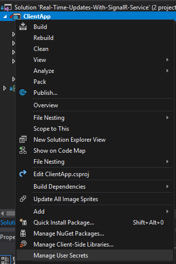

ASP.NET Core Client Application
===============================

[Home](readme.md)

This application is a standard ASP.NET Core application, that was built in Visual Studio 2017 from the standard ASP.NET Core Empty project template. Normally, you would probably use another template, but I've tried to keep things to a minimum so that we can focus on the actual matter in this sample, which is using the [Azure SignalR Service](https://azure.microsoft.com/en-us/services/signalr-service/).


Configuration
-------------

The first thing we're going to do is add configuration to it, to enable you to run the application in your development environment.

In Visual Studio 2017 in the *Solution Explorer*, right client the ASP.NET Core application `ClientApp`, and select *Manage User Secrets*, as shown in the image below.



This will open the settings file which is only available on your computer for your user profile. If you want to read more about user secrets, have a look at [this article](https://docs.microsoft.com/en-us/aspnet/core/security/app-secrets).

Make sure that you have the following information in that JSON file.

``` JSON
{
    "signalR": {
        "service": {
            "key": "<SignalR Service Key>",
            "hostName": "<SignalR Service name>.service.signalr.net"
        }
    }
}
```

You find both of these values after you've provisioned a SignalR Service instance to your Azure subscription. The values are available on the Keys blade of the service.

Azure Configuration
-------------------

When you deploy your application to an Azure App Service, you do the configuration a bit differently, since you can only configure key-value pairs for web applications running in Azure.

You need then to store the values with the following keys:
- `signalR:service:key`
- `signalR:service:hostName`

The values are the same as you store in your user secrets locally.

> I'm sure you know what everybody thinks about storing sensitive information as application settings. Luckily Microsoft is making it super easy to store your application settings in Azure Key Vault without having to make any changes to your code. You just run your application in Azure as you would locally. If you're interested, you can read more about [storing application settings in Key Vault](https://docs.microsoft.com/en-us/azure/app-service/app-service-key-vault-references).